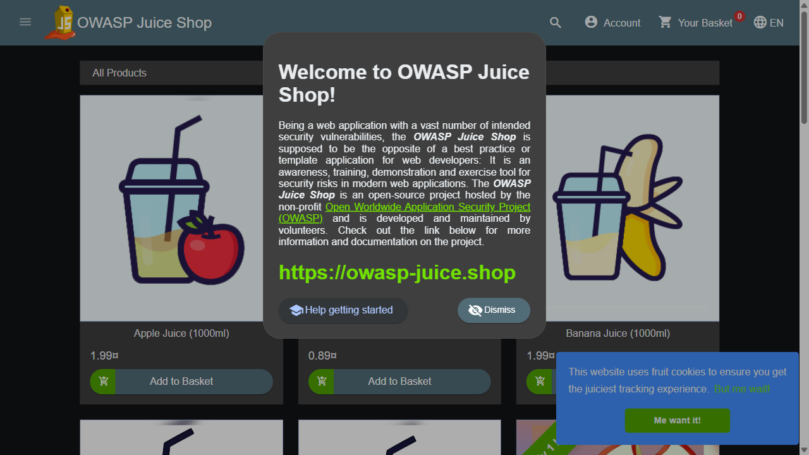
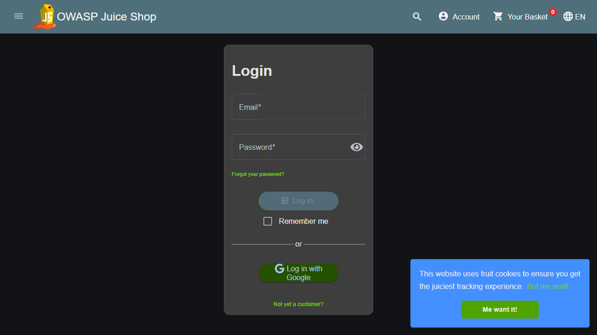
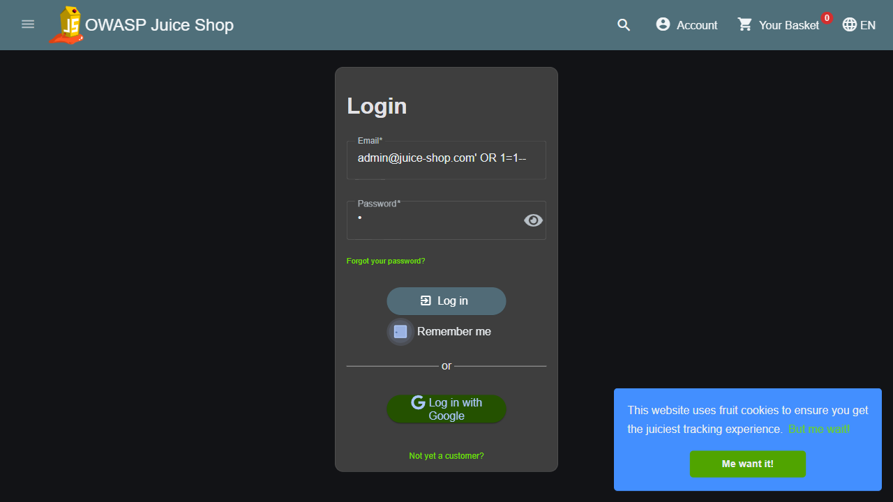
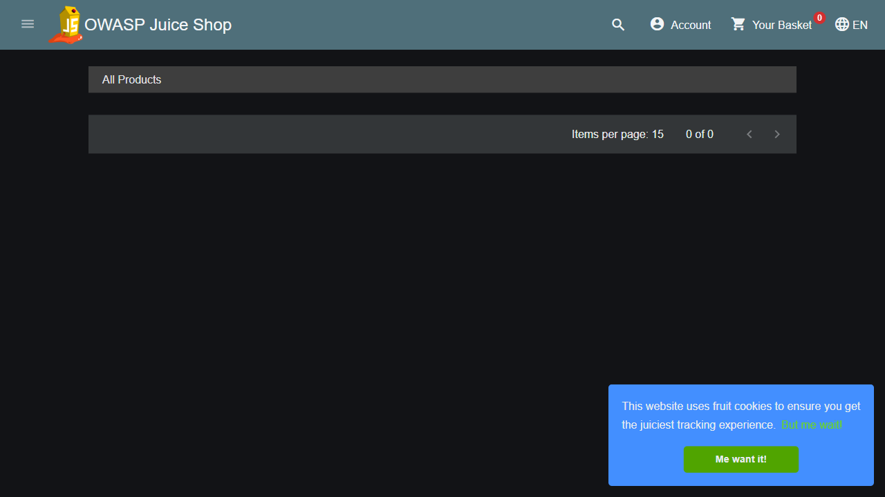

# SENTINEL: Autonomous Web-Pentesting Agent

**SENTINEL** is an autonomous web-pentesting agent driven by a fine-tuned Llama-3-8B model (via QLoRA adapter). Unlike traditional vulnerability scanners that rely on static heuristics and produce massive false-positive rates, SENTINEL acts as a specialized "brain" inside a closed loop (perceive → think → act → observe) to actively crawl, prioritize vulnerability sinks, and execute SQLi or XSS attacks against web applications.

It uses a robust DOM-pruning strategy to compress HTML into a security-relevant footprint and emits strict, executable ReAct JSON payloads to interface with the browser.

##  Live Interactive Demo
Try the model directly without any local setup via our Hugging Face Space:
🔗 **[SENTINEL Interactive Demo](https://huggingface.co/spaces/niranjan2777/Sentinel-web-pentesting)**

> **Note:** The Hugging Face Space runs on CPU-only free tier hardware. Inference will be slow and typically takes **1-2 minutes** per turn. For real-time autonomous execution, we highly recommend running it locally via Ollama.

##  Model Weights
The fine-tuned model weights are available on Hugging Face:
* **Base Model Tensors (LoRA Adapter):** [niranjan2777/SENTINEL](https://huggingface.co/niranjan2777/SENTINEL)
* **Quantized GGUF (Recommended for Consumer Hardware):** [niranjan2777/SENTINEL-q5_k_m-GGUF](https://huggingface.co/niranjan2777/SENTINEL-q5_k_m-GGUF)

---

## 🛠️ Setup Instructions

### 1. Install Dependencies
Ensure you have Python 3.10+ installed.
```bash
pip install -r requirements.txt
playwright install chromium
```

### 2. Sample OWASP Target Setup

```bash
docker-compose up -d juice-shop dvwa
```
* Juice Shop will be available at `http://localhost:3000`


### 3. Loading the GGUF Model into Ollama
For local inference, download the highly optimized `Q5_K_M` GGUF model and serve it using Ollama.
```bash
# 1. Download the quantized model from Hugging Face
cd model

# Linux / macOS
wget https://huggingface.co/niranjan2777/SENTINEL-q5_k_m-GGUF/resolve/main/model-q5_k_m.gguf

# Windows PowerShell
Invoke-WebRequest -Uri "https://huggingface.co/niranjan2777/SENTINEL-q5_k_m-GGUF/resolve/main/model-q5_k_m.gguf" -OutFile "model-q5_k_m.gguf"

# 2. Create an Ollama Modelfile
echo "FROM ./model-q5_k_m.gguf" > Modelfile

# 3. Create and serve the model locally
ollama create sentinel -f Modelfile
ollama serve
```

---

## ⚙️ How to Build and Run Configurations

The agent's behavior is driven by YAML configurations. Every scenario inherits from a base configuration (`config/default.yaml`) and overrides specific settings to define target constraints, budgets, and success criteria.

**Example Scenario Config (`config/scenarios/dvwa_sqli.yaml`):**
```yaml
extends: ../default.yaml

target:
  base_url: http://localhost:8080
  name: dvwa

# ─── SUCCESS CRITERIA ─────────────────────────────────────────────────────────
# The agent must autonomously reach one of two victory conditions:
#   1. LOGGED IN — SQLi bypass on /login.php
#   2. DATA EXFILTRATED — SQLi on /vulnerabilities/sqli/?id= 
# Whichever fires first wins. The agent gets no hints, no creds, no cheats.
# ──────────────────────────────────────────────────────────────────────────────
goal: DVWA_PWNED

budgets:
  max_iterations: 50
  max_model_calls: 100
  max_wall_seconds: 600

# Show the browser — lets you watch the attack live
browser:
  headless: false

observability:
  log_dir: artifacts/runs
  screenshots: true
```

### Running the Agent
Run the agent unattended against a scenario using the CLI:
```bash
python -m agent run --config config/scenarios/login_bypass.yaml
```
*The agent will autonomously navigate, prune the DOM, formulate attacks, inject payloads, and check goal states until the target goal is achieved or the token/iteration budget is exhausted.*

---

## 📸 Sample Output & Execution
During an attack run, SENTINEL logs every step and takes visual snapshots of its progress in the `artifacts/runs/` directory. Here is a sample execution sequence showing the agent's progress:

**Initial Target Identification & Crawl**


**Identifying Vulnerable Sinks**


**Formulating the Attack Strategy**


**Payload Injection (Pre-submit)**


**Exploitation Success**


To review the agent's full decision-making process and results, examine the generated logs located at `artifacts/runs/<run_id>/log.jsonl` (e.g. `artifacts/runs/1779148570-eb1004/log.jsonl`). This JSONL file tracks every ReAct loop, payload injection, and goal evaluation!
